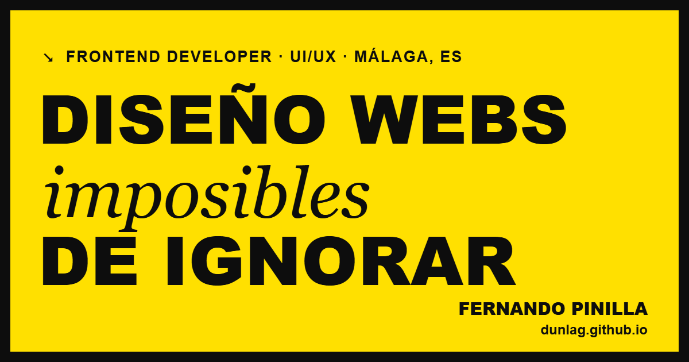

# Fernando Pinilla — Portfolio

Personal portfolio of a frontend developer and UI/UX designer based in Málaga. A single-page, bilingual (ES/EN) site with a bold editorial look: thick borders, condensed display type and an accent colour that changes on every visit.

**Live:** https://dunlag.github.io/fernando/



## Stack

| Tool | Why it is here |
| --- | --- |
| React 18 + Vite | Component model for a page made of independent sections; fast dev server and build. |
| TypeScript (strict) | The content model is typed: a project missing its copy in either language does not compile. |
| Zustand | Two pieces of state are shared across the page (active language, CV panel). A small store replaces passing them through a dozen components. |
| GSAP | Preloader, hero entrance, custom cursor and menu text animations. All respect `prefers-reduced-motion`. |
| Plain CSS | Design tokens as custom properties, no framework. The whole stylesheet is ~8 kB gzipped. |
| Vitest + Testing Library | Checks what types cannot: screenshot files exist, the store persists and validates, components render the right links. |
| ESLint + Prettier | Enforced in CI on every pull request, together with the typecheck, tests and build. |

There is no router, data-fetching library or CSS framework: the site has one page, no API and one visual theme, so none of them would solve a problem here.

## Run it

Requires the Node version in [`.nvmrc`](.nvmrc).

```bash
npm install
npm run dev        # http://localhost:5173/fernando/
```

| Script | What it does |
| --- | --- |
| `npm run build` | Typecheck, then production build into `dist/` |
| `npm run typecheck` | `tsc --noEmit` |
| `npm run lint` | ESLint |
| `npm run format` | Prettier (`format:check` to verify only) |
| `npm test` | Vitest, single run |

## Structure

```
src/
  data/index.ts     all content and its types — the single source of truth
  store.ts          Zustand store: language (persisted) and CV panel state
  App.tsx           section order and page-level effects
  components/       one file per section
  hooks/            useFitText, useScrollHide
  lib/              GSAP animations that live outside React
  styles/           design tokens and section styles
public/assets/      screenshots (WebP), CV, cover image
```

## How content works

Nothing is hard-coded in components. Every string lives in `src/data/index.ts`, once per language, and the `Copy` type guarantees both languages have the same shape.

To add a project:

1. Add an entry to `PROJECTS` with its `id`, links, tags and screenshots.
2. Add its `title` and `desc` under that `id` in both `PROJECT_COPY.es` and `PROJECT_COPY.en`. The build fails until both exist.
3. Put the screenshots in `public/assets/<project>/` as WebP. A test checks that every referenced file exists.

## Performance notes

- Screenshots are WebP at 1200px; the first load transfers roughly half a megabyte of images.
- The preloader plays once per session and lasts about a second.
- Asset paths are built from Vite's `BASE_URL`, so moving to another host or domain is a one-line change.

## Deployment

Pushing to `main` builds and publishes to GitHub Pages through [`.github/workflows/deploy.yml`](.github/workflows/deploy.yml).
